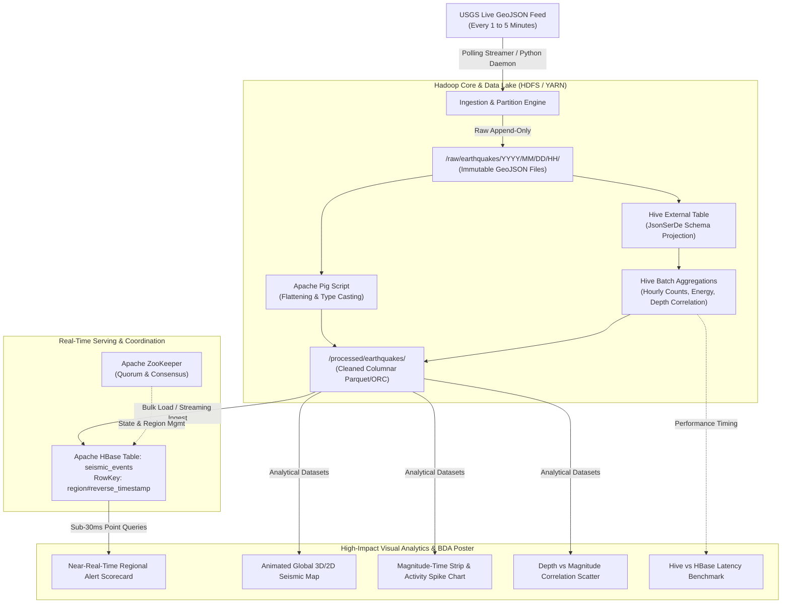

# System Architecture: Hadoop Ecosystem Real-Time Seismic Analytics

**Project Title:** End-to-End Real-Time Seismic Ingestion, Processing, and Serving using the Hadoop Ecosystem  
**Domain:** Big Data Analytics (BDA) Real-World Case Study  
**Data Source:** United States Geological Survey (USGS) Earthquake Hazards Program Live GeoJSON API  

---

## 1. Executive Summary & Problem Motivation

Geological monitoring agencies record thousands of seismic vibrations daily across planetary fault lines. Analyzing this volume of continuous, high-velocity geospatial data presents critical Big Data challenges:
1. **High-Velocity Ingestion:** Incoming continuous streams must be ingested without data loss and preserved in raw fidelity.
2. **Schema Heterogeneity:** GeoJSON responses contain nested JSON metadata (properties, geometries, coordinates) unsuitable for conventional relational stores without flattening.
3. **Dual Query Workload Dilemma:**
   - **Analytical Batch Workload (OLAP):** Long-term historical trend mining, magnitude-depth correlations, and planetary energy release calculations requiring high-throughput distributed parallel scans.
   - **Operational Point Workload (OLTP / Real-time Serving):** Instantaneous retrieval of recent earthquakes within a specific geographic region (e.g., "Give me the last 10 seismic events in Southern California right now") with sub-second response times.

A single storage or processing engine cannot satisfy both requirements efficiently. This project demonstrates how the **Hadoop Ecosystem components integrate symbiotically** to solve this dual-workload paradigm.

---

## 2. Hadoop Ecosystem Component Breakdown & Mapping

| Ecosystem Component | Architectural Role | Technical Responsibility in Case Study |
| :--- | :--- | :--- |
| **HDFS** (Hadoop Distributed File System) | **Distributed Raw & Processed Data Lake** | Provides resilient, fault-tolerant block storage. Separated into an immutable raw zone (`/raw/earthquakes/`) partitioned by ingestion hour, and an analytical zone (`/processed/earthquakes/`). Solves small-file issues via batch compaction. |
| **YARN** (Yet Another Resource Negotiator) | **Cluster Resource Orchestration** | Dynamically allocates vCores and memory across competing compute jobs (MapReduce tasks, Hive query containers, Pig execution plans). |
| **Apache Hive** | **Data Warehousing & SQL-on-Hadoop (OLAP)** | Employs JSON SerDe (`org.apache.hive.hcatalog.data.JsonSerDe`) to project relational schema over semi-structured GeoJSON. Performs heavy aggregation, partition pruning, and windowed analytics. |
| **Apache Pig** | **Procedural ETL & Nested Data Extraction** | Pig Latin pipeline used to parse complex nested JSON feature arrays, perform data cleansing, and transform raw payloads into clean tabular columnar formats. |
| **Apache HBase** | **Low-Latency Distributed NoSQL Store (OLTP)** | Column-oriented distributed store providing $O(1)$ random read/write lookups. Utilizes a composite **reverse-timestamp row key** (`region#reverse_timestamp`) to serve the latest regional seismic alerts in <30ms. |
| **Apache ZooKeeper** | **Distributed Coordination & Consensus** | Manages HBase master election, tracks live RegionServers, stores root HBase meta directory, and ensures cluster quorum state integrity. |
| **Oozie / Cron Engine** | **Workflow Scheduling & Pipeline Orchestration** | Coordinates periodic scheduled execution of ingestion batches, Hive partition updates, and compaction routines. |
| **Python Serving & Viz Layer** | **Presentation & Interactive Visual Analytics** | External visualization consumer built with Plotly, WebGL maps, and Dash/Streamlit. Reads directly from HBase for live alert feeds and Hive/Parquet exports for deep statistical visualizations. |

---

## 3. End-to-End Dataflow Lifecycle

---

## 4. Key Architectural Design Decisions & Trade-Offs

### 4.1 Storage Layout & The "Small File Problem" in HDFS
- **Problem:** Polling USGS every 5 minutes produces ~288 files per day. In production HDFS, each file creates a ~150-byte metadata entry in the NameNode's JVM heap. Left unmanaged, millions of small files degrade NameNode performance.
- **Solution:** Time-based hierarchical partitioning (`/raw/earthquakes/YYYY/MM/DD/HH/`) combined with scheduled hourly Hive/Pig consolidation jobs that compact raw JSON batches into optimized, partitioned ORC/Parquet files with Snappy compression in the processed zone.

### 4.2 Analytical Batch (Hive) vs. Low-Latency Serving (HBase)
- **The Empirical Comparison:**
  - When a seismic analyst requests: *"Show me the last 15 earthquakes in the Pacific Ring of Fire"*:
    - **Hive / HDFS approach:** Spawns Tez/MapReduce execution, queries across partitions, scans distributed blocks. Latency: **8 to 25 seconds**.
    - **HBase approach:** Direct indexed B-tree/LSM-tree seek on region key `RING_OF_FIRE#<reversed_ts>`. Scans contiguous cells in the RegionServer's BlockCache/MemStore. Latency: **8 to 25 milliseconds** (~1,000x faster).
  - This empirical comparison provides a compelling narrative for the BDA presentation poster.

### 4.3 Reverse-Timestamp Row Key Design in HBase
- Standard timestamp ordering (`region#timestamp`) forces queries for the "latest" events to scan to the end of the region.
- By using:
  $$\text{RowKey} = \text{region\_code} \parallel \text{"\#"} \parallel (\text{Long.MAX\_VALUE} - \text{epoch\_millis})$$
  the most recent earthquake events are physically stored at the **top** of the region. A regional scan with limit $N$ yields the latest seismic events in minimal I/O operations without reversing or sorting in memory.
