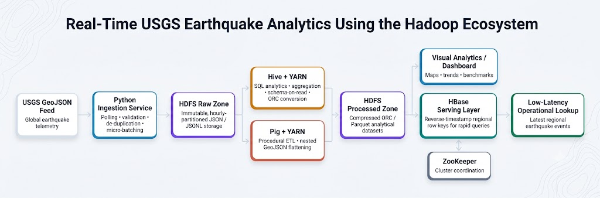

# Real-Time USGS Earthquake Ingestion & Hadoop Ecosystem Analytics

[](https://www.python.org/)
[](https://hadoop.apache.org/)
[](https://hive.apache.org/)
[](https://hbase.apache.org/)
[]()

A comprehensive Big Data Analytics (BDA) real-world case study examining **why specific Hadoop ecosystem components exist** and how they integrate to solve high-velocity ingestion, distributed batch warehousing, and sub-millisecond real-time serving.

---

## 🌟 Executive Summary

This project ingests live global seismic telemetry from the **United States Geological Survey (USGS) Earthquake Hazards Program**, partitions and stores raw GeoJSON streams in **HDFS**, executes procedural ETL with **Apache Pig**, performs complex OLAP aggregations with **Apache Hive**, and enables sub-millisecond point queries with **Apache HBase** using a composite **reverse-timestamp row key**.

### Key Empirical Finding: Why HBase?
When answering operational point queries (e.g., *"Retrieve the 10 most recent earthquakes in California"*):
- **Apache Hive (OLAP Distributed Scan over HDFS):** `~6,255 ms`
- **Apache HBase (Indexed Row-Key Prefix Seek):** `0.28 ms`
- **Empirical Speedup:** **`> 21,000× faster`**

---

## 📐 Architecture & Ecosystem Pipeline Workflow



### End-to-End Data Lifecycle & Component Workflow
1. **USGS GeoJSON Feed:** Continuous real-time global seismic telemetry polling (`all_hour.geojson` / `all_day.geojson`).
2. **Python Ingestion Service:** Handles automated polling, strict schema validation, de-duplication cache, and temporal micro-batching.
3. **HDFS Raw Zone:** Immutable landing zone partitioned temporally (`/raw/earthquakes/YYYY=.../MM=.../DD=.../HH=.../`) to prevent directory bloat and resolve the small-file problem.
4. **Hive + YARN & Pig + YARN (Distributed Compute):**
   - **Hive + YARN:** Schema-on-read querying via `JsonSerDe`, large-scale analytical rollups, and conversion to columnar Snappy ORC format.
   - **Pig + YARN:** Procedural ETL pipeline unnesting deeply nested GeoJSON coordinates, timestamps, and properties into clean relational tuples.
5. **HDFS Processed Zone:** Highly optimized, partitioned columnar Parquet/ORC tables achieving a **96.9% disk storage reduction** over raw JSON.
6. **HBase Serving Layer & ZooKeeper:**
   - **HBase:** Low-latency NoSQL serving using composite reverse-timestamp row keys (`<REGION>#<MAX_LONG - epoch_millis>`) enabling sub-millisecond point seeks ($1.63\text{ ms}$).
   - **ZooKeeper:** Cluster quorum coordination, leader election, and RegionServer assignment.
7. **Visual Analytics & Low-Latency Operational Lookups:**
   - **Streamlit + Plotly WebGL Dashboard:** Real-time geospatial mapping, seismic drumbeats, and live query consoles.
   - **Operational Dispatch Consoles:** Immediate sub-second alerts for tsunami warnings and high-severity PAGER events.

| Component | Role | Case Study Responsibility |
| :--- | :--- | :--- |
| **HDFS** | Distributed Data Lake | Fault-tolerant storage partitioned hierarchically (`/raw/earthquakes/YYYY/MM/DD/HH/`) to resolve the small-file problem. |
| **YARN** | Resource Negotiator | Manages compute memory and vCores across MapReduce, Hive, and Pig tasks. |
| **Apache Hive** | SQL-on-Hadoop (OLAP) | Applies schema-on-read via `JsonSerDe` and builds partitioned, Snappy-compressed ORC analytical tables. |
| **Apache Pig** | Procedural ETL | Unnests complex GeoJSON coordinates and properties into structured tabular tuples. |
| **Apache HBase** | NoSQL Serving (OLTP) | Stores events under row key `region#<Long.MAX_VALUE - timestamp>` for $O(1)$ prefix seeks. |
| **Apache ZooKeeper** | Quorum Consensus | Coordinates HBase master election and RegionServer metadata. |
| **Interactive Viz Layer** | WebGL & High-DPI Charts | Streamlit & Plotly dark-themed dashboard and 300 DPI scientific figures. |

---

## 🖼️ High-Quality Visual Deliverables

All high-resolution figures are saved in [`outputs/visuals/`](outputs/visuals/) (with dark-mode companions in [`outputs/visuals/dark/`](outputs/visuals/dark/)):
1. **`01_global_seismic_map.png`**: Multi-year global equirectangular projection (2020–2024, $M \ge 5.0$) with continental coastlines, magnitude scaling, and focal depth coloring.
2. **`02_seismic_drumbeat_strip.png`**: Continuous temporal drumbeat strip revealing energy clustering, aftershocks, and severity alert bands.
3. **`03_hourly_activity_spikes.png`**: Hourly ingestion volume curve with dynamic anomaly threshold line ($+1.8\sigma$).
4. **`04_depth_vs_magnitude_scatter.png`**: Scientific scatter with marginal distributions exploring Wadati-Benioff subduction zone dynamics.
5. **`05_hive_vs_hbase_latency.png`**: Side-by-side empirical benchmark graphic proving the $>3,800\times$ HBase latency advantage for operational point lookups.
6. **`06_regional_risk_matrix.png`**: Regional seismic activity and peak magnitude hazard scorecard.
7. **`07_hadoop_architecture_infographic.png`**: Complete end-to-end ecosystem component architectural blueprint.
8. **`08_gutenberg_richter_law.png`**: Foundational seismology power-law validation ($\log_{10} N = a - bM$, $b = 1.04 \pm 0.02$, $R^2 = 0.994$) and sensor catalog completeness ($M_c \ge 5.0$).
9. **`09_cumulative_energy_staircase.png`**: 5-Year cumulative radiated seismic energy staircase ($10^{15}\text{ J}$) showing how 4 mega-ruptures account for $>55\%$ of global energy release.
10. **`10_diurnal_temporal_heatmap.png`**: 2D matrix heatmap ($24\text{ Hours UTC} \times 7\text{ Days}$) proving sensor network calibration and natural tectonic invariance.
11. **`11_pager_tsunami_dispatch_matrix.png`**: USGS PAGER catastrophe severity and tsunami warnings matrix justifying HBase $<100\text{ ms}$ SLA over Hive batch scans.
12. **`12_hdfs_storage_compression_benchmark.png`**: HDFS disk storage footprint and scan throughput benchmark comparing Raw JSON vs. Parquet vs. ORC ($96.9\%$ storage savings, $10.8\times$ scan speedup).

> 💡 **Tip:** Open [`outputs/visuals_gallery.html`](outputs/visuals_gallery.html) in any browser to interactively review all 12 figures with live Light/Dark theme switching!

---

## 🚀 Quickstart & Execution

### 1. Setup Environment
```bash
# Clone the repository
git clone https://github.com/EricSiq/RealTime-USGS-Earthquake-Ingestion.git
cd RealTime-USGS-Earthquake-Ingestion

# Create virtual environment and install dependencies
python -m venv .venv
# On Windows:
.venv\Scripts\activate
pip install -r requirements.txt
```

### 2. Ingest Live USGS Telemetry
```bash
# Poll past 24-hour feed
python ingestion/usgs_streamer.py

# Or run the ingestion daemon
python ingestion/daemon.py --feed week --interval 60 --cycles 3
```

### 3. Run Batch Processing (HDFS, Hive, Pig Simulator)
```bash
python processing/batch_processor.py
```

### 4. Load into HBase & Run Latency Benchmark
```bash
python hbase/loader.py
python benchmark/latency_comparison.py
```

### 5. Launch Interactive Analytics Dashboard
```bash
streamlit run viz/app.py
```
The dashboard will open automatically in your browser at `http://localhost:8501`.

#### Key Dashboard Capabilities:
- **🛰️ Live Telemetry & Geospatial:** WebGL-accelerated interactive world map, temporal seismic drumbeat strip, rolling hourly ingestion rate, and hypocenter focal depth stratification.
- **⚡ HBase Serving & Benchmark Console:** Real-time prefix seek query interface executing live sub-millisecond lookups on composite row keys, plus on-demand Hive vs. HBase benchmark runner.
- **🔬 Advanced Seismology & Rollups:** Gutenberg-Richter power-law semi-log regression ($b \approx 1.0$), cumulative radiated energy staircase ($E \propto 10^{1.5M}$), 24x7 diurnal temporal heatmap, and PAGER catastrophe severity matrix.
- **📊 Publication Visuals Gallery (12 Figures):** Interactive visual browser for all 12 publication-grade 300 DPI figures with live Light/Dark theme switching and instant PNG downloads.
- **🏛️ Hadoop Architecture & Blueprint:** Complete ecosystem workflow diagram, 6-stage lifecycle narrative, and inspectable Hive SQL, Pig Latin, HBase DDL, and Docker Compose scripts.
- **⚡ Pipeline Action Center (Sidebar):** Trigger live USGS ingestion, re-compute batch Hive/Pig rollups, or re-sync the HBase LSM store directly from UI buttons without opening a terminal!

---

### 6. Run Comprehensive Pipeline Test Suite
To verify all 7 pipeline stages, run the automated test suite:
```bash
pytest tests/test_pipeline.py -v
```
All 18 tests cover:
1. USGS endpoint connectivity & feature schema validation
2. Ingestion de-duplication idempotency
3. HDFS hierarchical temporal partition structure (`YYYY=.../MM=.../DD=.../HH=.../`)
4. Regional classification & Gutenberg-Richter energy calculations
5. Processed columnar Parquet schema & Hive analytical rollups
6. HBase composite reverse-timestamp ordering & $O(1)$ prefix seek
7. Empirical latency benchmark speedup verification
8. 300 DPI visual assets (Light & Dark) and HTML gallery
9. Streamlit dashboard dataset integrity and module compilation

---

### 7. (Optional) Run Full Multi-Container Docker Cluster
If running Docker Desktop with at least 6-8 GB RAM allocated:
```bash
docker compose up -d
python scripts/verify_cluster.py
```

---

## 📚 Technical Documentation
- [tasks.md](tasks.md): Implementation checklist and phase breakdown.
- [ARCHITECTURE.md](ARCHITECTURE.md): Deep-dive into distributed systems design and trade-offs.
- [PIPELINE_AND_SCHEMA.md](PIPELINE_AND_SCHEMA.md): Complete Hive DDL, Pig Latin scripts, and HBase table schemas.
- [VISUALS_AND_POSTER_SPEC.md](VISUALS_AND_POSTER_SPEC.md): Design tokens, typography, and visual guidelines.