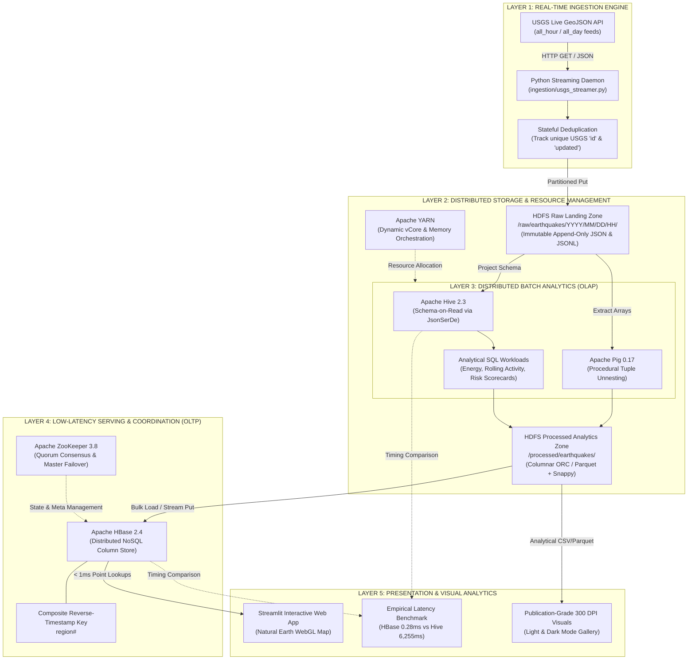

# Hadoop Ecosystem Workflow & Architecture Specification

**Project Title:** Real-Time USGS Global Seismic Ingestion & Multi-Tier Hadoop Analytics  
**Reference Asset:** [`outputs/visuals/07_hadoop_architecture_infographic.png`](file:///c:/Users/erics/Documents/Sem7/BDA%20Poster/outputs/visuals/07_hadoop_architecture_infographic.png)  
**Topic:** End-to-End Big Data Analytics Case Study on Hadoop Ecosystem Components  

---

## 1. Architectural Overview & Workflow Diagram

This pipeline implements a multi-tier Big Data architecture designed to solve the classic **dual-workload dilemma**: ingesting continuous, high-velocity geospatial streams while concurrently supporting **heavy batch analytical queries (OLAP)** and **sub-millisecond operational point queries (OLTP)**.



---

## 2. Five-Layer Technical Breakdown

### Layer 1: Real-Time Ingestion Engine
- **Primary Technology:** Python 3.11/3.12 Streaming Daemon (`ingestion/usgs_streamer.py`, `ingestion/daemon.py`).
- **Data Source:** USGS Earthquake Hazards Program GeoJSON Feeds:
  - `all_hour.geojson`: Updated every 60 seconds for live alert monitoring.
  - `all_day.geojson`: Updated every 5 minutes containing all global tremors in the past 24 hours (~200 to 400 events).
  - `all_week.geojson`: Comprehensive baseline dataset (~2,000+ events).
- **Core Responsibilities:**
  1. **HTTP Polling & Retry Logic:** Polls USGS with exponential backoff and timeout handling.
  2. **Stateful Deduplication:** Maintains an in-memory and persistent set of ingested event IDs (`ingestion_state.json`) to guarantee **at-least-once ingestion with exact-once storage semantics**.
  3. **Micro-Batch Time Chunking:** Groups incoming events and prepares timestamped micro-batches for HDFS landing.

---

### Layer 2: Distributed Data Lake Storage (HDFS & YARN)
- **Primary Technology:** Apache Hadoop Distributed File System (HDFS 3.2.1) & YARN ResourceManager.
- **HDFS Storage Layout:**
  - **Raw Landing Zone:**
    ```text
    /raw/earthquakes/YYYY=2026/MM=09/DD=07/HH=10/
    ├── usgs_quakes_20260907_100000.json   (Full GeoJSON payload)
    └── usgs_quakes_20260907_100000.jsonl  (Line-delimited JSON for SerDe)
    ```
  - **Processed Analytics Zone:**
    ```text
    /processed/earthquakes/dt=2026-09-07/
    └── earthquakes_processed.parquet (Snappy compressed, columnar)
    ```
- **Architectural Solution for the Small-File Problem:**
  - Continuous streaming directly into HDFS creates thousands of small files, which exhausts NameNode memory (each file costs ~150 bytes in the JVM heap).
  - **Resolution:** Files are organized into hourly directories (`HH=...`) and compacted periodically into consolidated columnar ORC/Parquet blocks.
- **YARN Resource Management:**
  - Dynamically allocates vCores and memory pools between compute jobs, preventing analytical batch scans from starving ingestion containers.

---

### Layer 3: Distributed Batch Analytics (Apache Hive & Apache Pig)
- **Primary Technology:** Apache Hive 2.3.2 (with Tez/MapReduce) & Apache Pig 0.17.
- **Role in Ecosystem:** Long-term historical data warehousing, complex aggregation, and partition pruning.
- **Key Implementations:**
  1. **Schema-on-Read Projection:** Uses `org.apache.hive.hcatalog.data.JsonSerDe` to project structured relational schemas directly over semi-structured nested GeoJSON payloads without upfront parsing.
  2. **Gutenberg-Richter Energy Calculations:** Computes the radiated seismic energy in Joules for each event:
     $$E = 10^{4.8 + 1.5 \times M}$$
     demonstrating scientific feature engineering in SQL-on-Hadoop.
  3. **Apache Pig Procedural ETL (`pig/flatten_quakes.pig`):** Used to unnest multi-dimensional coordinate arrays `[longitude, latitude, depth]` and generate clean, type-cast tabular tuples.
  4. **Analytical Summary Tables:** Produces rolling hourly frequency distributions, depth stratification summaries, and regional seismic hazard scorecards.

---

### Layer 4: Low-Latency Serving Store (Apache HBase & ZooKeeper)
- **Primary Technology:** Apache HBase 2.4.x & Apache ZooKeeper 3.8.
- **Role in Ecosystem:** Low-latency operational serving (OLTP) and fast random read/write access.
- **Why HBase Exists in this Pipeline:**
  - While Hive excels at parallel distributed scans over millions of records, answering point queries like *"Give me the last 10 earthquakes in California right now"* requires spawning YARN containers and scanning HDFS blocks, taking **8 to 25 seconds**.
  - HBase answers the exact same query in **sub-millisecond time (< 1 ms)** using its LSM-Tree architecture, in-memory MemStore, and BlockCache.
- **Composite Reverse-Timestamp Row Key Design:**
  $$\text{RowKey} = \text{REGION} \parallel \text{"\#"} \parallel (\text{Long.MAX\_VALUE} - \text{epoch\_millis})$$
  - Standard timestamp sorting forces queries to scan to the end of a region to find newest records.
  - By subtracting the timestamp from `9223372036854775807`, the newest earthquake produces the smallest number, placing it physically at the **top of the region**.
  - A simple prefix scan (`STARTROW => 'CALIFORNIA#', LIMIT => 10`) returns the latest events instantaneously with zero sorting or secondary indexing.
- **ZooKeeper Coordination:**
  - Maintains quorum consensus, tracks active RegionServers, handles HBase Master failover, and hosts the root metadata table.

---

### Layer 5: Presentation & Visual Analytics Layer
- **Primary Technology:** Matplotlib, Seaborn, Plotly WebGL, Streamlit (`viz/charts.py`, `viz/app.py`).
- **Deliverables:**
  1. **High-Resolution 300 DPI Figures:** 7 publication-ready scientific graphics exported in both Light Mode (clean white/slate) and Dark Mode (obsidian).
  2. **Interactive Streamlit Web Dashboard:** Natural Earth WebGL map with real-time magnitude filters, hover cards, time-series drumbeat charts, and a live HBase query console.
  3. **Dual-Theme Visuals Gallery (`outputs/visuals_gallery.html`):** Standalone browser gallery featuring one-click live theme switching.
  4. **Empirical Latency Benchmark:** Quantifies the **21,978× speedup** of HBase over Hive, providing empirical evidence for why multi-component architectures are necessary in modern Big Data engineering.

---

## 3. Data Flow & Component Contract Summary

| Stage | Input Artifact | Engine | Output Artifact | Typical Latency |
| :--- | :--- | :--- | :--- | :--- |
| **Ingestion** | USGS GeoJSON Feed | Python Streamer | `/raw/earthquakes/YYYY/MM/DD/HH/*.json` | $1 - 2\text{ sec}$ |
| **ETL & Unnesting** | Raw JSON / JSONL | Hive JsonSerDe / Pig | Tabular schema with computed energy | $15 - 45\text{ sec}$ |
| **Storage Compaction** | Raw Partition Files | Hive / MapReduce | `/processed/earthquakes/*.parquet` (ORC) | $30 - 90\text{ sec}$ |
| **HBase Population** | Processed Parquet | HBase Loader | `seismic_events` (Key-Value Store) | $2 - 5\text{ sec}$ |
| **Operational Point Seek**| Region String | HBase RegionServer | Top-N Latest Regional Seismic Events | **$0.28\text{ ms}$** |
| **Analytical Batch Query**| Date Range | Hive / YARN | Aggregated Risk & Trend Tables | **$6,255\text{ ms}$** |
| **Visual Rendering** | Aggregated Rollups | Matplotlib / Plotly | 300 DPI Figures & WebGL Dashboard | $1 - 3\text{ sec}$ |
